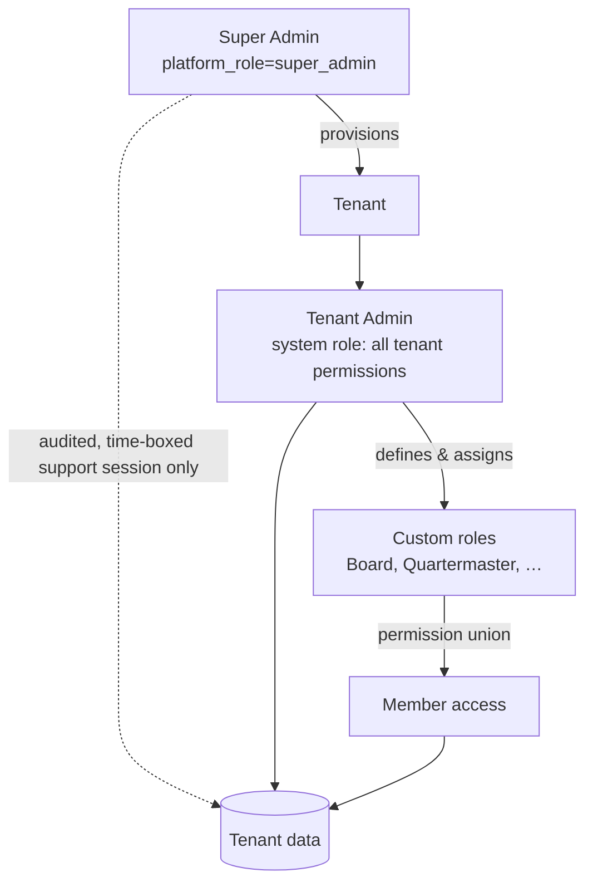
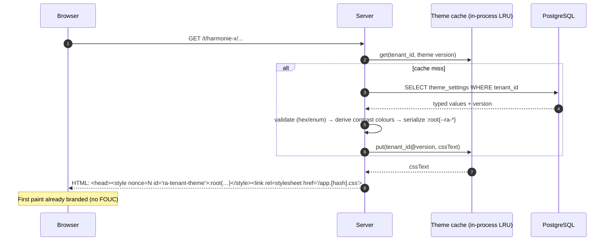

# RestAssured — System Specification (Baseline v0.1)

- **Status:** Draft baseline · **Date:** 2026-09-24
- **Authoritative decisions:** `ai-docs/decisions/` (ADRs win over this document on conflict;
  fix this document when they diverge).

## 1. Scope

RestAssured manages club-owned and privately-owned assets (instruments, uniforms/clothing,
accessories, cases) for music clubs, tracks who holds what, and forecasts depreciation,
maintenance, and replacement budgets. It is multi-tenant, bilingual (`nl`/`en`), tenant-themable,
and GDPR-aware.

### Actors

| Actor            | Scope    | Description |
|------------------|----------|-------------|
| Super Admin      | Platform | Operates the deployment: provisions/suspends tenants, platform defaults, SMTP. |
| Tenant Admin     | Tenant   | Club administrator; holds all tenant permissions (system role). |
| Inventory manager | Tenant | Has an account and one or more custom roles: board member, quartermaster, instrument manager, viewer… |
| Member (reference) | Tenant | **The majority.** No account; exists only as a `tenant_memberships` row so the club can see who has what (e.g. a child borrowing a clarinet). Never logs in. |

---

## 2. Data model

### 2.1 ER diagram

```mermaid
erDiagram
    TENANTS ||--o{ TENANT_MEMBERSHIPS : has
    USERS |o--o{ TENANT_MEMBERSHIPS : "logs in as"
    TENANTS ||--o{ ROLES : defines
    ROLES ||--o{ ROLE_PERMISSIONS : grants
    PERMISSIONS ||--o{ ROLE_PERMISSIONS : "granted by"
    TENANT_MEMBERSHIPS ||--o{ MEMBERSHIP_ROLES : holds
    ROLES ||--o{ MEMBERSHIP_ROLES : "assigned via"
    TENANTS ||--|| THEME_SETTINGS : "styled by"
    TENANTS ||--o{ ASSET_CATEGORIES : defines
    TENANTS ||--o{ LOCATIONS : has
    ASSET_CATEGORIES ||--o{ ASSETS : classifies
    TENANTS ||--o{ ASSETS : owns
    ASSETS ||--o{ ASSIGNMENTS : "checked out in"
    TENANT_MEMBERSHIPS |o--o{ ASSIGNMENTS : "holds (assignee)"
    LOCATIONS |o--o{ ASSIGNMENTS : "stored at"
    TENANT_MEMBERSHIPS |o--o{ ASSETS : "privately owns"
    USERS ||--o{ SESSIONS : has
    USERS |o--o{ AUTH_TOKENS : "target of"
    TENANTS ||--o{ AUDIT_LOG : records
    TENANTS ||--o{ ERASURE_LOG : records
    TENANTS ||--o{ FORECAST_SNAPSHOTS : stores

    TENANTS {
        uuid id PK
        text slug UK
        text name
        text status "active|suspended|archived"
        text default_locale "nl|en"
        char3 currency "EUR"
        smallint fiscal_year_start_month
        timestamptz created_at
    }
    USERS {
        uuid id PK
        citext email UK "PII"
        text password_hash "nullable"
        text preferred_locale "nullable"
        text platform_role "nullable: super_admin|support"
        uuid last_tenant_id "nullable"
        timestamptz email_verified_at
        timestamptz erased_at
    }
    TENANT_MEMBERSHIPS {
        uuid tenant_id PK,FK
        uuid id PK
        uuid user_id FK "nullable"
        text display_name "PII"
        citext email "PII"
        text phone "PII"
        text member_number "PII"
        text notes "PII free_text"
        text status "invited|active|inactive|anonymized"
        char8 pseudonym_id "set on anonymization"
        timestamptz anonymized_at
    }
    ROLES {
        uuid tenant_id PK,FK
        uuid id PK
        text label_key "system/template roles"
        jsonb label_i18n "renamed/custom roles"
        bool is_system "Tenant Admin"
        int version
    }
    PERMISSIONS {
        text code PK "assets:edit"
        text group_key
        text label_key
        bool is_dangerous
    }
    ROLE_PERMISSIONS {
        uuid tenant_id PK
        uuid role_id PK
        text permission_code PK
    }
    MEMBERSHIP_ROLES {
        uuid tenant_id PK
        uuid membership_id PK
        uuid role_id PK
    }
    THEME_SETTINGS {
        uuid tenant_id PK,FK
        char7 color_primary
        char7 color_secondary
        char7 color_accent "nullable"
        text radius "none|sm|md|lg"
        text font_family "system|serif|rounded"
        text density "compact|comfortable"
        text logo_object_key "nullable"
        int version
    }
    ASSET_CATEGORIES {
        uuid tenant_id PK
        uuid id PK
        text kind "instrument|clothing|accessory|case"
        text label_key "nullable"
        jsonb label_i18n "nullable"
        smallint lifespan_years "nullable override"
        numeric residual_pct "nullable override"
        numeric maintenance_pct "nullable override"
    }
    LOCATIONS {
        uuid tenant_id PK
        uuid id PK
        text name "proper name, not translated"
        timestamptz archived_at
    }
    ASSETS {
        uuid tenant_id PK
        uuid id PK
        uuid category_id FK
        text tag "club inventory number"
        text brand "Merk"
        text model
        text serial_number "Serienr"
        text description
        bigint purchase_price_cents "nullable"
        smallint purchase_year "nullable"
        bigint insured_value_cents "nullable"
        smallint insured_value_year "nullable"
        text ownership "club|private"
        uuid owner_membership_id "if private"
        text status "active|in_repair|retired|lost|sold"
        smallint lifespan_years "nullable override"
        timestamptz created_at
    }
    ASSIGNMENTS {
        uuid tenant_id PK
        uuid id PK
        uuid asset_id FK
        uuid membership_id FK "nullable (xor location)"
        uuid location_id FK "nullable (xor membership)"
        timestamptz checked_out_at
        timestamptz returned_at "nullable = open"
        text condition_out
        text condition_in
        text notes "PII free_text"
        uuid issued_by_membership_id
    }
    SESSIONS {
        bytea token_hash PK
        uuid user_id FK
        uuid scoped_tenant_id "nullable (ADR-0004)"
        timestamptz expires_at
        timestamptz last_seen_at
    }
    AUTH_TOKENS {
        bytea token_hash PK
        text purpose "magic_login|invite|password_reset"
        uuid user_id "nullable"
        uuid membership_id "nullable"
        uuid issued_by "nullable"
        uuid issued_in_tenant_id "nullable"
        timestamptz expires_at
        timestamptz consumed_at
    }
    AUDIT_LOG {
        uuid tenant_id PK
        bigint id PK
        uuid actor_membership_id
        text action "asset.updated"
        text subject_type
        uuid subject_id
        jsonb changed_fields "names only for PII"
        timestamptz at
    }
    ERASURE_LOG {
        uuid tenant_id PK
        uuid membership_id PK
        text level "tenant|account"
        uuid executed_by
        timestamptz executed_at
    }
    FORECAST_SNAPSHOTS {
        uuid tenant_id PK
        uuid id PK
        jsonb params
        jsonb result
        smallint from_year
        smallint horizon
        uuid created_by
        timestamptz created_at
    }
```



### 2.2 Key constraints

| Constraint | Definition |
|------------|------------|
| Tenant isolation | RLS `ENABLE` + `FORCE` on all tables with `tenant_id`; policy per ADR-0001. |
| Composite FKs | e.g. `assignments(tenant_id, asset_id) → assets(tenant_id, id)`. |
| One user per tenant | `UNIQUE (tenant_id, user_id) WHERE user_id IS NOT NULL` on memberships. |
| One open assignment per asset | `UNIQUE (tenant_id, asset_id) WHERE returned_at IS NULL`. |
| Assignee xor location | `CHECK ((membership_id IS NULL) <> (location_id IS NULL))`. |
| Private ownership | `CHECK (ownership = 'club' OR owner_membership_id IS NOT NULL)`. |
| Serial uniqueness | `UNIQUE (tenant_id, lower(coalesce(brand, '')), lower(serial_number)) WHERE serial_number IS NOT NULL`: the same serial from the same brand is the same instrument. |
| Tag uniqueness | `UNIQUE (tenant_id, lower(tag)) WHERE tag IS NOT NULL` (club inventory number). |
| Deleting assets | Only assets without any assignment history; others are set to retired, lost or sold. |
| Money | `*_cents bigint CHECK (>= 0)`. |
| Years | `purchase_year BETWEEN 1900 AND extract(year from now()) + 1`. |
| Audit append-only | `ra_app` has `INSERT, SELECT` only on `audit_log`, `erasure_log`. |

### 2.3 Spreadsheet field mapping

| Spreadsheet (nl) | Field | i18n key |
|---|---|---|
| Categorie | `category_id` | `assets.field.category` |
| Merk | `brand` | `assets.field.brand` |
| Model / Type | `model` | `assets.field.model` |
| Serienr | `serial_number` | `assets.field.serial_number` |
| Omschrijving | `description` | `assets.field.description` |
| Aanschafprijs | `purchase_price_cents` | `assets.field.purchase_price` |
| Aanschafjaar | `purchase_year` | `assets.field.purchase_year` |
| Verzekerde waarde | `insured_value_cents` | `assets.field.insured_value` |
| Eigendom (Vereniging/Privé) | `ownership` | `assets.field.ownership` |
| Waar | open `assignments` row (member or location) | `assets.field.location_assignee` |

---

## 3. Authorization

### 3.1 Hierarchy



### 3.2 Scope capabilities

| Capability | Super Admin | Tenant Admin | Custom role (if granted) |
|---|---|---|---|
| Create / suspend / archive tenants | ✅ | ❌ | ❌ |
| Platform defaults (categories, forecast defaults), SMTP | ✅ | ❌ | ❌ |
| Provision first Tenant Admin | ✅ | ❌ | ❌ |
| Read tenant data | Only via audited support session | ✅ | per permission |
| Tenant settings & theme | ❌ | ✅ | `tenant:manage_settings`, `tenant:manage_theme` |
| Define roles / edit matrix | ❌ | ✅ | `roles:manage` (no escalation) |
| Issue reset / login links | ❌ (platform users via own flow) | ✅ | `members:reset_password` |
| Anonymize member | Account erasure only (on verified request) | ✅ | `members:anonymize` |

### 3.3 Default permission matrix (tenant templates, editable)

Legend: ✅ granted by default · — not granted. Tenant Admin (system) holds all.

| Permission | Board Member (Bestuurslid) | Quartermaster (Materiaalbeheerder) | Instrument Manager (Instrumentbeheerder) | Viewer (Meekijker) |
|---|:-:|:-:|:-:|:-:|
| `assets:view` | ✅ | ✅ | ✅ | ✅ |
| `assets:create` | — | ✅ | ✅ | — |
| `assets:edit` | — | ✅ | ✅ | — |
| `assets:delete` | — | ✅ | — | — |
| `assets:view_financials` | ✅ | ✅ | — | — |
| `assignments:view` | ✅ | ✅ | ✅ | ✅ |
| `assignments:manage` | — | ✅ | ✅ | — |
| `members:view` | ✅ | ✅ | ✅ | ✅ |
| `members:manage` | ✅ | — | — | — |
| `members:invite` | ✅ | — | — | — |
| `members:reset_password` ⚠ | — | — | — | — |
| `members:anonymize` ⚠ | — | — | — | — |
| `members:export_data` | ✅ | — | — | — |
| `roles:view` | ✅ | — | — | — |
| `roles:manage` ⚠ | — | — | — | — |
| `financials:read_forecasts` | ✅ | ✅ | — | — |
| `financials:configure_forecasts` | ✅ | — | — | — |
| `tenant:manage_settings` | — | — | — | — |
| `tenant:manage_theme` | — | — | — | — |
| `audit:view` | ✅ | — | — | — |
| `data:import` | — | ✅ | — | — |
| `data:export` | ✅ | ✅ | — | — |

⚠ = dangerous; confirmation required to grant; reserved for Tenant Admin by default.

### 3.4 Request authorization pipeline

```mermaid
sequenceDiagram
    autonumber
    participant B as Browser
    participant MW as Middleware
    participant DB as PostgreSQL
    participant H as Handler
    B->>MW: GET /t/harmonie-x/assets (cookie)
    MW->>DB: lookup session by sha256(token)
    DB-->>MW: user_id, scoped_tenant_id
    MW->>DB: tenant by slug + active membership for user
    alt no membership OR scoped_tenant_id ≠ tenant
        MW-->>B: 404
    end
    MW->>DB: resolve permissions (membership_roles ⋈ role_permissions)
    MW->>MW: route requires assets:view? present?
    alt missing
        MW-->>B: 403 {code: "errors.forbidden"}
    end
    MW->>DB: BEGIN; set_config('app.tenant_id', id, true)
    MW->>H: ctx {user, tenant, membership, permissions, locale}
    H->>DB: SELECT … WHERE tenant_id = $1 (RLS also applies)
    H-->>B: 200 (financial fields stripped w/o assets:view_financials)
    MW->>DB: COMMIT
```

---

## 4. Tenant theme injection

### 4.1 Server render (first paint)



### 4.2 Tenant switch (client)

1. User picks a club in the TenantSwitcher → navigate to `/t/{newSlug}/…`.
2. With client-side navigation: `fetch('/t/{newSlug}/theme.css', {headers: {'If-None-Match': etag}})`.
3. Replace `#ra-tenant-theme` text content; swap logo `src`; update `<html lang>` if the tenant
   default locale applies.
4. Without JS: a full page load does steps 1–3 server-side.

### 4.3 Theme save (Tenant Admin)

1. Editor posts typed values; server validates format and enums.
2. Server computes relative luminance and contrast of text on primary/secondary; rejects
   < 4.5:1 with `errors.theme.contrast_too_low` + measured ratio.
3. Persist, increment `version`, invalidate cache, write audit entry.

### 4.4 Serialized token block

```css
:root{
  --ra-color-primary:#1f4e79;
  --ra-color-primary-contrast:#ffffff;
  --ra-color-secondary:#c9a227;
  --ra-color-secondary-contrast:#000000;
  --ra-color-accent:#1f4e79;
  --ra-radius:6px;
  --ra-font-family:system-ui,-apple-system,"Segoe UI",Roboto,sans-serif;
  --ra-space-unit:8px;
}
/* in app.css (static): */
.btn-primary{background:var(--ra-color-primary);color:var(--ra-color-primary-contrast)}
.btn-primary:hover{background:color-mix(in oklab,var(--ra-color-primary) 85%,black)}
```

---

## 5. GDPR anonymization

### 5.1 Tenant-level anonymization sequence

```mermaid
sequenceDiagram
    autonumber
    actor A as Tenant Admin (members:anonymize)
    participant UI
    participant G as GDPR service
    participant DB as PostgreSQL (withTenant)
    A->>UI: "Anonymize member" on member page
    UI->>G: POST /t/x/members/{id}/anonymization/preview
    G->>DB: count affected rows; open assignments; last-admin check
    DB-->>G: report
    G-->>UI: preview {fields, rows, openAssignments, blockers}
    alt blockers (last Tenant Admin)
        UI-->>A: show blocker, stop
    end
    A->>UI: type member's display name to confirm
    UI->>G: POST …/anonymization {confirm}
    G->>DB: BEGIN; set app.tenant_id
    G->>DB: UPDATE tenant_memberships SET PII cols = NULL, user_id = NULL, status='anonymized', pseudonym_id = random8, anonymized_at = now()
    G->>DB: UPDATE assignments (+ other PII free_text cols) SET notes = NULL WHERE membership_id = id
    G->>DB: DELETE membership_roles; DELETE auth_tokens WHERE membership_id = id
    G->>DB: verify: SELECT PII cols IS NOT NULL → must be 0
    G->>DB: INSERT erasure_log; INSERT audit_log (ids only)
    G->>DB: COMMIT
    alt user has no other active memberships and requested account erasure
        G->>G: eraseAccount(user_id) (§5.2)
    end
    G-->>UI: done; history now shows "Geanonimiseerd lid #3f9a1c20"
```

### 5.2 Account erasure

1. For each active membership: run §5.1 in that tenant (each tenant's own transaction).
2. `UPDATE users SET email = 'erased+'||id||'@invalid', password_hash = NULL, preferred_locale
   = NULL, erased_at = now()`; delete sessions and tokens.
3. Platform audit entry (ids only).

### 5.3 Display rule

`membership.status = 'anonymized'` ⇒ render `t('members.anonymized_label', {id: pseudonym_id})`
(`nl`: "Geanonimiseerd lid #{id}", `en`: "Anonymized Member #{id}").

### 5.4 Restore safety

After any backup restore, `replayErasures()` re-applies every `erasure_log` row (idempotent)
before the application accepts traffic.

---

## 6. Financial forecasting

### 6.1 Notation

| Symbol | Meaning | Source |
|---|---|---|
| `P` | purchase price (cents) | asset; fallback insured value |
| `y₀` | purchase year | asset |
| `V`, `y_V` | insured value and the year it was set | asset |
| `L` | lifespan (years) | asset → tenant category → platform default |
| `r` | residual fraction (0–1) | same resolution |
| `m` | annual maintenance fraction of replacement cost | same |
| `k`, `s` | major-service interval (years), major-service fraction | same (optional) |
| `i` | annual price inflation | tenant setting |
| `Y` | projection year; `Y₀` = reference (first) year; `H` horizon (years) | request |
| `R₀` | current reserve balance (cents) | tenant setting / request |

All results are rounded to whole cents with banker's rounding (half-to-even) **per asset per
year**; totals are sums of rounded values.

### 6.2 Formulas

**Age:** `a(Y) = Y − y₀`.

**Book value — straight line** (default):
```
BV(Y) = max( P·r ,  P − (P − P·r) · min(a, L) / L )      for a ≥ 0
```

**Book value — declining balance:**
```
d     = 1 − r^(1/L)
BV(Y) = max( P·r ,  P · (1 − d)^a )
```

**Replacement cost** (inflation-indexed; prefers the most recent valuation):
```
if V and y_V known:  RC(Y) = V · (1 + i)^(Y − y_V)
else:                RC(Y) = P · (1 + i)^(Y − y₀)
```

**Replacement events:** the first due year is `Y_r = y₀ + L` (or `y_last_replacement + L`).
If `Y_r < Y₀` the asset is **overdue** and is scheduled at `Y₀` (flag `overdue`; optional
tenant setting spreads the overdue backlog evenly over `n` years). After replacement the
next event is `Y_r + L`, with `RC` re-based at the replacement year.

**Maintenance:**
```
M(Y) = m · RC(Y)                                   (not in a replacement year)
S(Y) = s · RC(Y)   if k set and (Y − y_base) mod k = 0 and Y is not a replacement year
```
where `y_base` is the purchase or last replacement year.

**Annual budget:**
```
B(Y) = Σ_assets [ M(Y) + S(Y) + RC(Y)·[Y is replacement year] ]
```

**Recommended level annual reserve contribution** (smallest constant yearly amount keeping the
reserve non-negative across the horizon):
```
C = max( 0 ,  max_{n=1..H} ( Σ_{Y=Y₀}^{Y₀+n−1} B(Y) − R₀ ) / n )
```

**Insurance adequacy** (club-owned and optionally private assets):
```
ratio(Y₀) = V_current / RC(Y₀)
under-insured if ratio < 0.90 ;  over-insured if ratio > 1.20   (tenant-configurable)
```

### 6.3 Inclusion rules

- Budget: `ownership = 'club'` and `status IN ('active','in_repair')`.
- Missing `y₀` → excluded from depreciation; replacement based on `V` if present, flagged
  `incomplete`. Missing both `P` and `V` → excluded, reason `forecast.excluded.no_value`.
- `y₀ > Y₀` (future purchase) → included from `y₀` onward.
- Retired/sold/lost → excluded from future years.

### 6.4 Worked example

Trumpet, `P = €1 200.00` (120 000 ¢), `y₀ = 2016`, `L = 20`, `r = 0.10`, `m = 0.02`, `i = 0.03`,
no valuation, `Y₀ = 2027`.

| Quantity | Computation | Result |
|---|---|---|
| Age 2027 | 2027 − 2016 | 11 |
| Book value 2027 | 120 000 − 108 000 · 11/20 | 60 600 ¢ = €606.00 |
| RC 2027 | 120 000 · 1.03¹¹ = 166 108.06 | 166 108 ¢ = €1 661.08 |
| Maintenance 2027 | 0.02 · 166 108 = 3 322.16 | 3 322 ¢ = €33.22 |
| Replacement year | 2016 + 20 | 2036 |
| RC 2036 | 120 000 · 1.03²⁰ = 216 733.35 | 216 733 ¢ = €2 167.33 |

These values are the first rows of the forecasting engine's table-driven test suite.

### 6.5 Output shape

```ts
type ForecastResult = {
  params: ResolvedParamsSummary;
  years: Array<{
    year: number;
    maintenanceCents: bigint;
    majorServiceCents: bigint;
    replacementCents: bigint;
    totalCents: bigint;
    byCategory: Record<CategoryId, bigint>;
  }>;
  recommendedAnnualContributionCents: bigint;
  assets: Array<{ assetId: string; events: ForecastEvent[]; flags: ('overdue'|'incomplete')[] }>;
  excluded: Array<{ assetId: string; reasonCode: string }>; // reasonCode is an i18n key
  insurance: Array<{ assetId: string; ratio: number; status: 'ok'|'under'|'over' }>;
};
```

---

## 7. Non-functional requirements

| Area | Target |
|---|---|
| Performance | p95 page TTFB < 300 ms for tenants with ≤ 5 000 assets; forecast < 100 ms compute |
| Payload | ≤ 100 KB gzipped JS, ≤ 30 KB CSS on initial route |
| Availability | Single VM + managed/self-hosted Postgres; daily backups, 35-day retention |
| Security | OWASP ASVS L2 as guideline; CSP with nonces; HSTS; `__Host-` cookies |
| Accessibility | WCAG 2.2 AA |
| Privacy | GDPR/AVG; processor agreement (verwerkersovereenkomst) template for clubs |
| i18n | `nl`, `en`; CI key parity |
